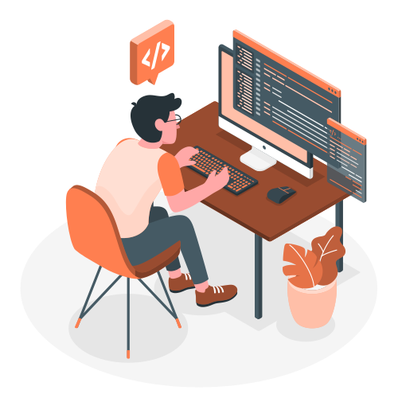

# Hi nice to meet you 👋
My name is Pedro Levi, and I’m a Fullstack Developer with experience in React.js, JavaScript, Node.js, SQL, and other modern web technologies.
I recently graduated in Systems Analysis and Development (ADS) at UNOESTE, and I am currently in the final stage of my English course at CCAA.
At the moment, I’m actively developing my skills through several personal and academic projects, continually improving both my backend and frontend capabilities. I’m always exploring new technologies, tools, and best practices to elevate the quality of my work.
I have solid hands-on experience in building fullstack applications and enjoy transforming ideas into functional, well-structured solutions.

## 🔎 Technologies & Languages 
 
 
 
 
 
 

 
 
 

  

> Using [📊storyset](https://storyset.com/web)

[Badges](https://github.com/Ileriayo/markdown-badges)
<!--
**tavinholoco/tavinholoco** is a ✨ _special_ ✨ repository because its `README.md` (this file) appears on your GitHub profile.
<a href="https://storyset.com/web">Web illustrations by Storyset</a>

Here are some ideas to get you started:

- 🔭 I’m currently working on ...
- 🌱 I’m currently learning ...
- 👯 I’m looking to collaborate on ...
- 🤔 I’m looking for help with ...
- 💬 Ask me about ...
- 📫 How to reach me: ...
- 😄 Pronouns: ...
- ⚡ Fun fact: ...
-->
