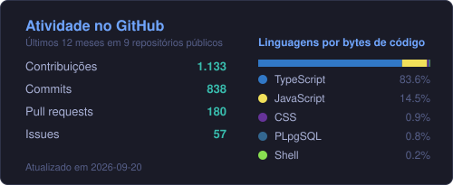

# Pedro Levi Dias

**Desenvolvedor Fullstack | Web e Mobile | TypeScript**

[English](README.md) | **Português**

Disponível para oportunidades fullstack (remoto ou híbrido, Brasil)

---

## Sobre

Construo produtos de ponta a ponta com TypeScript, do banco de dados à interface. Next.js e Fastify na web, React Native e Expo no mobile, PostgreSQL e Prisma por baixo.

Formado em Análise e Desenvolvimento de Sistemas pela UNOESTE. Prezo por código tipado, testes automatizados, separação clara de responsabilidades e documentação que outra pessoa consegue seguir. Todos os projetos abaixo têm README próprio e pipeline de CI rodando a cada push.

Atualmente construindo o **Netsheet Engine** e evoluindo o **Newra News**.

---

## Projetos em destaque

| Projeto | O que é | Stack |
| --- | --- | --- |
| [Repertório Progressivo](https://github.com/tavinholoco/repertorio-progressivo) · [APK](https://github.com/tavinholoco/repertorio-progressivo/releases/latest) | App Android para organizar rotinas de estudo: agenda de lembretes, notificações push e rastreamento de aproveitamento mensal e anual | React Native, Expo, TypeScript, NativeWind, Jest |
| [Newra News](https://github.com/tavinholoco/newra-news) · [Demo](https://newra-news-web.vercel.app) | Portal de notícias com briefing diário gerado por IA. Monorepo Turborepo com API Fastify e frontend Next.js | Next.js, Fastify, TypeScript, Prisma, PostgreSQL |
| [Trak Assessoria](https://github.com/tavinholoco/Trak-Acessoria) · [Demo](https://trak-acessoria.vercel.app) | Landing page para assessoria do mercado de arte, com formulário validado, dark mode, SEO técnico e pirâmide completa de testes | Next.js, TypeScript, Tailwind CSS, shadcn/ui, Playwright |
| [Netsheet Engine](https://github.com/tavinholoco/NetsheetEngine) | Suite de fichas e mesa virtual para Cyberpunk 2020, com mesas multiplayer em tempo real e assistente netrunner com IA | React 19, Vite, TypeScript, Express, Supabase |

<b>Detalhes técnicos por projeto</b>

 

**Repertório Progressivo**

- Arquitetura em camadas: `AsyncStorage` para services, context, hooks e components
- 144 testes em 8 suites: 6 unitárias, 2 de integração montando os providers reais
- Notificações Android agendadas via `expo-notifications`
- Funciona totalmente offline: sem conta, sem servidor, sem chamada de rede
- Builds de release com minificação R8, resource shrinking e split do AAB por idioma, densidade e ABI
- 8 diagramas Mermaid de arquitetura em `docs/architecture.md`

**Newra News**

- Monorepo Turborepo com `apps/web` (Next.js) e `apps/api` (Fastify) em pnpm workspaces
- Centenas de artigos por dia vindos do NewsData.io e de 12 feeds RSS, deduplicados em um briefing diário
- Google Gemini como modelo principal e Groq como fallback; todo briefing cita as fontes e declara que foi gerado por IA
- PostgreSQL na Neon com Prisma, migrations aplicadas por um workflow dedicado, nunca da máquina local
- 1.409 testes unitários e de integração mais 29 specs Playwright rodando contra produção
- Seis workflows no GitHub Actions: CI, Gitleaks, Smoke E2E, Lighthouse CI, Migrate e Keep-alive

**Trak Assessoria**

- Next.js 16 (App Router) com React 19, shadcn/ui e Base UI como primitivas de acessibilidade
- Formulário de contato com React Hook Form e Zod, validado no cliente e de novo no servidor, enviado via Resend
- Dark mode persistido com next-themes e CSP declarada em `next.config.ts`
- 132 testes unitários e de componente em 33 arquivos, 18 specs E2E em Chromium, Firefox, WebKit e viewport de 375px
- Cobertura travada em 80% de statements e 85% de linhas
- SEO técnico com JSON-LD, sitemap e Open Graph, mais consentimento LGPD

**Netsheet Engine**

- Criador de fichas com calculador de estatísticas, cyberware, lifepath e rolador de dados FNFF
- Mesas multiplayer em tempo real sobre WebSockets e Yjs, com grid tático, iniciativa e poderes de GM
- Supabase para auth, PostgreSQL, realtime e storage; Express servindo a SPA em uma única porta
- Assistente netrunner integrado à API do Gemini
- Varredura de segredos com Gitleaks no CI, com regras customizadas e hook de pre-commit opcional

---

## Destaques técnicos

- 1.409 testes automatizados em 127 suites no Newra News, com piso de 70% de cobertura travado no CI
- Pirâmide completa de testes no Trak Assessoria: unitário e de componente com Vitest, end to end com Playwright em 3 navegadores mais mobile, auditoria de acessibilidade com axe-core
- 144 testes em 8 suites no Repertório Progressivo, sobre uma arquitetura em camadas documentada em 8 diagramas Mermaid
- Pipeline diário de conteúdo no Newra News usando Google Gemini com fallback para Groq, em monorepo Turborepo com pnpm workspaces

---

## Stack

| Camada | Tecnologias |
| --- | --- |
| Linguagens | TypeScript, JavaScript, C, C++ |
| Mobile | React Native, Expo, NativeWind |
| Frontend | React, Next.js, Vite, Tailwind CSS, shadcn/ui, React Hook Form, Zod |
| Backend | Node.js, Fastify, Express, Prisma |
| Banco de dados | PostgreSQL, Supabase, MySQL |
| Testes | Vitest, Jest, Playwright, Testing Library |
| Ferramentas | Git, GitHub Actions, Turborepo, pnpm, ESLint, Vercel |

---

## GitHub

---

## Contato

[Portfólio](https://portfolio-tau-five-f86nc5khr8.vercel.app/) | [LinkedIn](https://www.linkedin.com/in/pedro-levi-dias-96720126a/) | [pedrolevidiass@gmail.com](mailto:pedrolevidiass@gmail.com)
